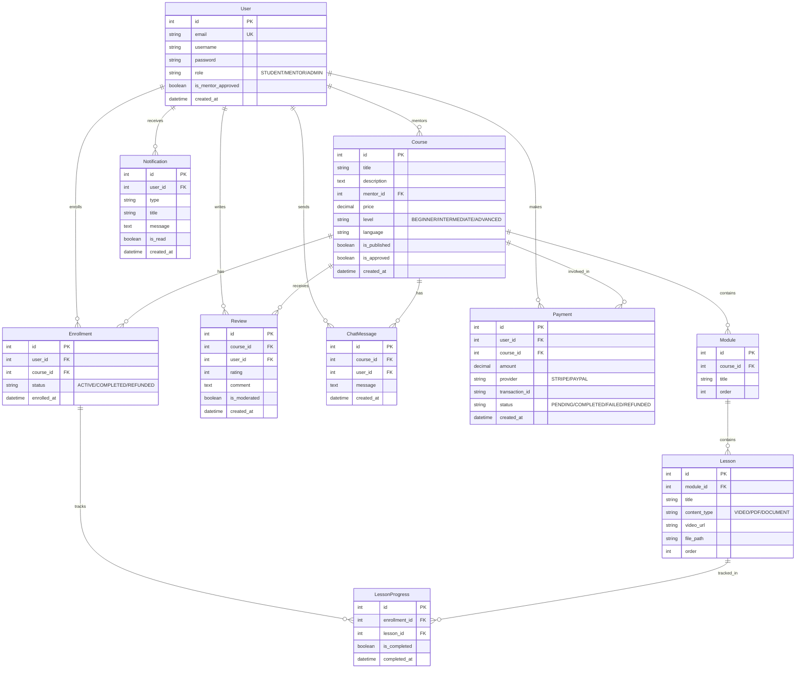

# Architecture Design - Online Learning Platform

## 1. Project Overview
A modular monolith Online Learning Platform built with Django and React. The system supports multiple user roles (Students, Mentors, Admins) and covers the full lifecycle of online education: course creation, enrollment, payments, content delivery, progress tracking, and student-mentor interaction.

## 2. Major Modules
- **Authentication & User Management**: JWT-based auth with role-based access control (RBAC).
- **Course Management**: Module and lesson structure with support for videos and document uploads.
- **Enrollment & Payment System**: Integration with Stripe and PayPal for course purchases.
- **Learning Experience**: Progress tracking, completion certificates, and lesson navigation.
- **Engagement & Communication**: Real-time Q&A via WebSockets and course reviews.
- **Notification Engine**: Multi-channel notifications (In-app, WebSocket, Email).
- **Search & Discovery**: Filtered search for courses and mentors.
- **Administration**: Approval workflows for courses/mentors and content moderation.

## 3. Technology Stack
- **Backend**: Django, Django REST Framework
- **Frontend**: React, React Router, Axios
- **Database**: PostgreSQL
- **Real-time**: Django Channels, Redis
- **Payments**: Stripe & PayPal Sandbox
- **Deployment**: Docker, AWS

## 4. User Roles & Permissions
### Student
- Browse/Search courses.
- Purchase and enroll in courses.
- Access course content (Lessons, Modules).
- Track learning progress.
- Post course reviews.
- Participate in Q&A discussion rooms.
- Receive notifications.

### Mentor
- Create and manage courses (Modules/Lessons).
- View student progress in their courses.
- Participate in Q&A/Respond to students.
- Request course publication/approval.
- Manage their mentor profile.

### Admin
- User management (including mentor approval).
- Course review and approval.
- Content moderation (Reviews, Chat).
- Refund processing.
- Access platform-wide analytics and reports.

## 5. Database Schema (ER Diagram)

## 6. Implementation Plan

### Phase 1: Foundation & Setup [COMPLETED]
- Initialize Django & React projects. ✅
- Configure PostgreSQL & Docker. ✅
- Setup environment variables. ✅

### Phase 2: Authentication [COMPLETED]
- JWT Token implementation (Access/Refresh). ✅
- Role-based registration and login flows. ✅
- Generic Permission classes for Student/Mentor/Admin. ✅

### Phase 3: Course Management [COMPLETED]
- Mentor-specific APIs for course, module, and lesson CRUD. ✅
- Content upload support (Local storage). ✅
- Course browsing and Curriculum structure views. ✅

### Phase 4: Enrollment & Payments [COMPLETED]
- Course browsing & Detail views. ✅
- Stripe/PayPal Sandbox integration. ✅
- Enrollment creation upon successful payment verification. ✅
- My Courses student dashboard. ✅

### Phase 5: Learning & Progress [COMPLETED]
- Progress tracking logic (Lesson completion). ✅
- Certificate generation (Text/PDF). ✅
- Learning Dashboard for students. ✅
- Mentor analytics for course completions. ✅

### Phase 6: Interaction Systems [COMPLETED]
- Ratings & Reviews module with moderation flags. ✅
- Real-time Q&A system using Django Channels. ✅
- WebSocket broadcasting for questions/answers. ✅

### Phase 7: Search & Notifications
- PostgreSQL-based filtered search.
- WebSocket-based real-time notifications for key events.

### Phase 8: Admin & Moderation
- Admin dashboard for user and content management.
- Refund handling and reporting.
