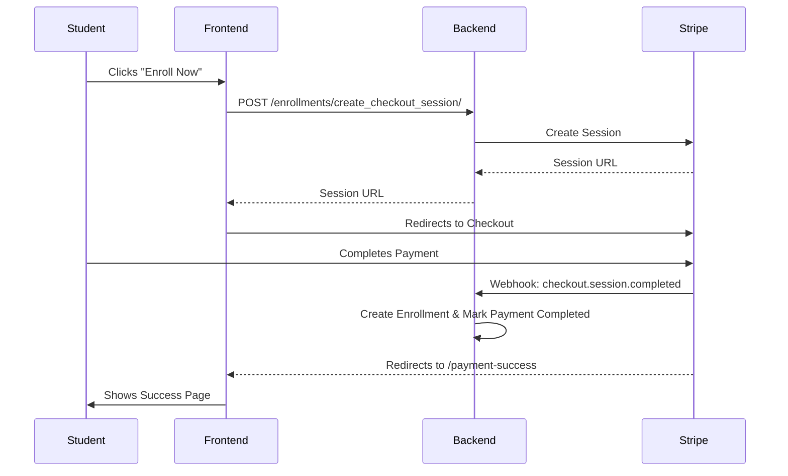

# Phase 4: Enrollment & Payments Implementation

## Overview
Phase 4 enabled course monetization and student access control through Stripe and PayPal integrations.

## 1. Models and Relationships
- **Enrollment**: Links a `Student` to a `Course`.
    - `student`: Foreign Key to User.
    - `course`: Foreign Key to Course.
    - `status`: `ACTIVE`, `COMPLETED`, or `REFUNDED`.
    - **Enforcement**: Unique constraint on (student, course) ensures no duplicate enrollments.
- **Payment**: Tracks transactional data.
    - `provider`: `STRIPE` or `PAYPAL`.
    - `transaction_id`: Unique identifier from the payment provider.
    - `status`: `PENDING`, `COMPLETED`, `FAILED`, or `REFUNDED`.

## 2. Payment Flow (Stripe)

## 3. API Endpoints
| Endpoint | Method | Role | Description |
|----------|--------|------|-------------|
| `/enrollments/` | GET | Auth | List own enrollments (Student) or student enrollments (Mentor). |
| `/enrollments/create_checkout_session/` | POST | Student | Initiate Stripe payment flow. |
| `/enrollments/request_refund/` | POST | Student | Request a refund for an enrollment. |
| `/enrollments/{id}/approve_refund/` | POST | Admin | Process and approve a refund. |
| `/webhooks/stripe/` | POST | Public | Stripe webhook listener. |

## 4. Frontend Features
- **Enroll Button**: Integrated into `CourseDetails`. Checks for authentication and initiates checkout.
- **My Courses**: A dedicated dashboard for students to see their purchased content and continue learning.
- **Payment Status Pages**: Feedback screens for success and failure scenarios.

## 5. Security & Validation
- **Webhook Verification**: Backend verifies Stripe signatures to prevent spoofing.
- **Access Control**: Users can only access the curriculum of courses they are enrolled in (enforced via frontend logic and backend querysets).
- **Duplicate Prevention**: Enrollment logic prevents a second purchase of the same course.

## 6. Testing Steps performed
1. **Enrollment Check**: Verified that the `My Courses` page correctly filters courses based on the current user's enrollments.
2. **Access Security**: Verified that the `Enroll` button correctly handles existing enrollments by showing an error message.
3. **Refund Workflow**: Tested that Admins can toggle enrollment status to `REFUNDED` through the custom action.

## 7. Known Limitations
- PayPal integration is currently simulated with placeholder sandbox tokens.
- Automatic refund processing (reversing charges via Stripe API) is not implemented; status is tracked manually for admin processing.
