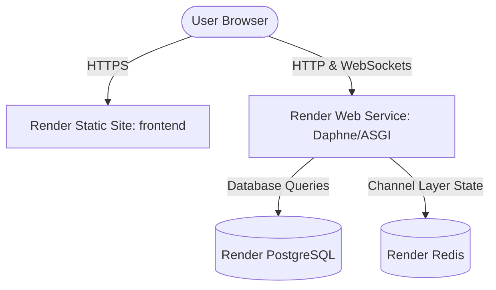

# Render.com Deployment Guide

This guide details how to deploy the **Online Learning Platform** on [Render.com](https://render.com). 

Since this platform utilizes **Django Channels (ASGI) with Redis** for real-time notifications and Q&A, and a **Vite React Single Page Application (SPA)**, we will deploy it using:
1. **Render PostgreSQL** (for the database)
2. **Render Redis** (for the Channel Layer)
3. **Render Web Service** running **Daphne** (for the unified HTTP + WebSocket backend)
4. **Render Static Site** (for the fast, free frontend host)

---

## 🏛️ Deployment Architecture Diagram

---

## 🛠️ Step-by-Step Deployment Instructions

### Step 1: Create a PostgreSQL Database on Render
1. Log in to your [Render Dashboard](https://dashboard.render.com).
2. Click **New** (top right) and select **PostgreSQL**.
3. Configure the database:
   - **Name**: `online-learning-db`
   - **Database**: `online_platform`
   - **User**: `online_user`
4. Choose the **Free** instance (or any tier you prefer).
5. Click **Create Database**.
6. Once created, copy the **Internal Database URL** (for backend communication) or **External Database URL** (if managing migration from outside). We will use the **Internal Database URL** as `DATABASE_URL`.

---

### Step 2: Create a Redis Instance on Render
1. In your Render Dashboard, click **New** and select **Redis**.
2. Configure the instance:
   - **Name**: `online-learning-redis`
3. Click **Create Redis**.
4. Once created, copy the **Internal Redis Connection String** (starts with `redis://...`). We will use this as `REDIS_URL`.

---

### Step 3: Deploy the Backend (Django + Channels)
We will deploy the backend as a **Web Service** using the ASGI server **Daphne** (which handles HTTP, REST APIs, and WebSockets on the same port).

1. Click **New** and select **Web Service**.
2. Connect your Git repository.
3. Configure the Web Service:
   - **Name**: `online-learning-backend`
   - **Root Directory**: `backend`
   - **Runtime**: `Python`
   - **Build Command**: `pip install -r requirements.txt`
   - **Start Command**: `daphne -b 0.0.0.0 -p $PORT core.asgi:application`
4. Expand the **Advanced** section and add the following **Environment Variables**:
   
   | Key | Value | Note |
   |---|---|---|
   | `DEBUG` | `False` | Run in production mode |
   | `SECRET_KEY` | *Your Random Long String* | Production Django Secret Key |
   | `ALLOWED_HOSTS` | `*` or `online-learning-backend.onrender.com` | Allowed backend domains |
   | `DATABASE_URL` | *Your Render PostgreSQL Internal URL* | Copy from Step 1 |
   | `REDIS_URL` | *Your Render Redis Internal URL* | Copy from Step 2 |
   | `CORS_ALLOWED_ORIGINS` | *Your Render Frontend URL* | We will update this in Step 4 |
   | `FRONTEND_URL` | *Your Render Frontend URL* | We will update this in Step 4 |
   | `DJANGO_SETTINGS_MODULE` | `core.settings` | ASGI setting target |

5. Click **Create Web Service**.
6. To run database migrations and seed default content upon deployment, you can configure a **Pre-Deploy Command** (under Settings) or add a release script:
   - **Pre-Deploy Command**: `python manage.py migrate --noinput`

---

### Step 4: Deploy the Frontend (React + Vite)
We will deploy the frontend as a **Static Site**, which is fast and completely free on Render.

1. Click **New** and select **Static Site**.
2. Connect your Git repository.
3. Configure the Static Site:
   - **Name**: `online-learning-platform`
   - **Root Directory**: `frontend`
   - **Build Command**: `npm run build`
   - **Publish Directory**: `dist`
4. Expand the **Advanced** section and add the following **Environment Variables**:

   | Key | Value | Note |
   |---|---|---|
   | `VITE_API_URL` | `https://online-learning-backend.onrender.com/api` | Your deployed backend URL |
   | `VITE_WS_URL` | `wss://online-learning-backend.onrender.com` | Your deployed backend URL using `wss` |

5. Click **Create Static Site**.
6. Once deployed, copy your frontend site URL (e.g., `https://online-learning-platform.onrender.com`).
7. **Important**: Go back to your **Backend Web Service** settings and update `CORS_ALLOWED_ORIGINS` and `FRONTEND_URL` with your new frontend URL.

---

## 💳 Payment Integrations (Optional)

If using Stripe or PayPal payments, make sure to add the respective API keys to your Backend Web Service Environment Variables:

- `STRIPE_SECRET_KEY`
- `STRIPE_PUBLISHABLE_KEY`
- `STRIPE_WEBHOOK_SECRET` (Generate this in your Stripe Dashboard by routing events to `https://online-learning-backend.onrender.com/api/webhooks/stripe/`)
- `PAYPAL_CLIENT_ID`
- `PAYPAL_CLIENT_SECRET`

---

## 🔒 Security Best Practices
- **Production Database**: Always use SSL for database connections (Render PostgreSQL handles this by default).
- **Environment Variables**: Never commit credentials in `.env` files to git. Use Render's environment variable panel exclusively.
